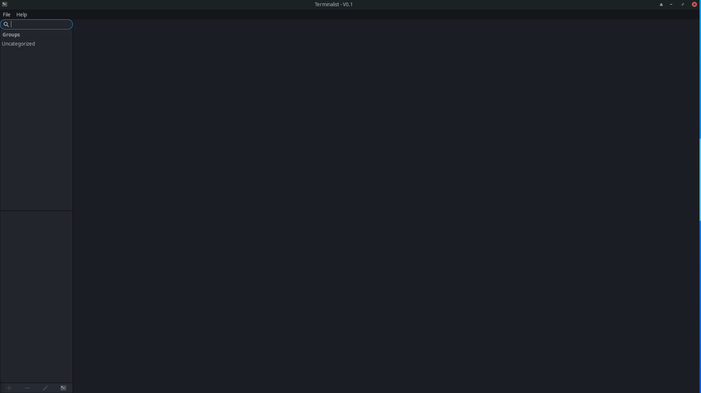
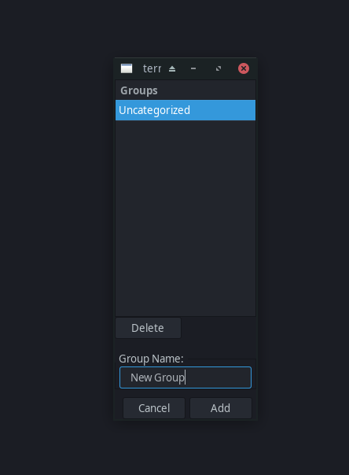
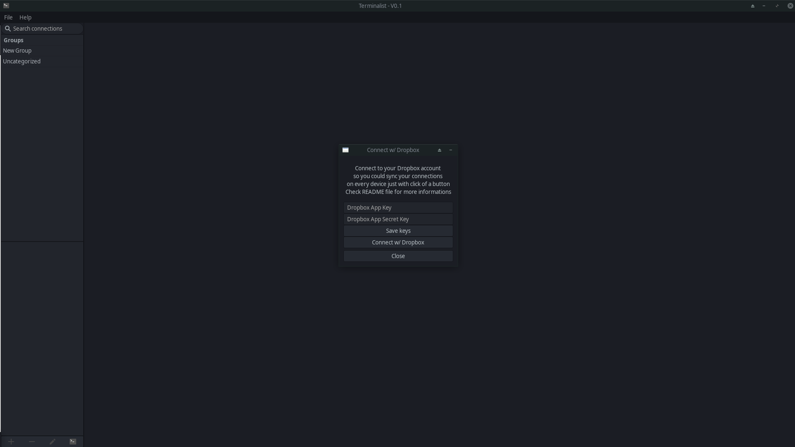
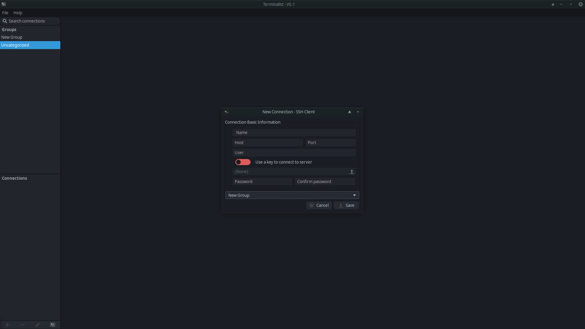
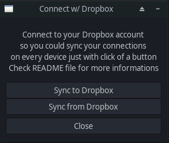

## **Terminalist v0.1**

### Compatibility

- [x] Linux
- [ ] MacOS (not tested, not sure is VTE is compatible w/ Mac)
- [ ] Windows ( Probably will never be supported - VTE incompatible )

### Before running
3. Copy `.env.example` to `.env`
4. Copy `sshclient.db.initial` to `sshclient.db`

### Contributing

Feel free to fork the repo, ask any questions or report a bug on [Discord](https://discord.gg/H5y5AyTHmQ)

### About

Terminalist is a Python3 based application for managing your SSH connections.

It's based on [SSHClient](http://vitorluis.github.io/SSHClient/) made by [Vitor Villar](vitor.luis98@gmail.com) so
credits to the guy :).

Terminalist is an improved version of SSHClient(at least I think so), that now w/ all SSHClient features has:

1. Tabbed connections(better UX)
2. Connection groups
3. Database sync using Dropbox(More about this later in README)

### Dropbox sync:

1. You will need to have your own Dropbox account, register for free [here](https://www.dropbox.com/register)
2. Go to https://www.dropbox.com/developers/apps/create
    1. Choose an API -> Scoped Access
    2. Choose the type of access you need -> App Folder
    3. Name your app -> Terminalist
    4. Use the provided app key and app secret in Terminalist app to connect with your Dropbox

### TODO

- [ ] Refresh groups after adding/deleting new
- [ ] Make ssh possible w/ using password ( Connections right now are only possible using ssh keys )
- [ ] Add ability to edit groups
- [ ] Add ability to sync ssh keys using dropbox
- [ ] Implement other sync methods (Google Drive, etc. what other people need)

### Screenshots:

